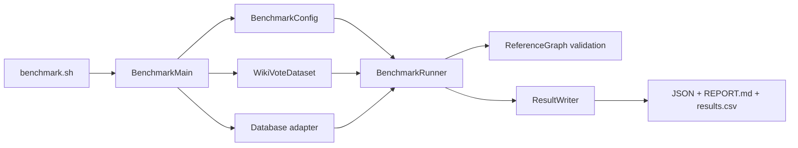

# CognoDB graph database benchmark

A small Java 11 benchmark harness for comparing CognoDB Cloud with Neo4j, Memgraph, FalkorDB, and ArangoDB on the same directed graph and logical workloads.

The goal is reproducibility and honest reporting, not manufacturing a winner.

## Status at a glance

- The Java project builds, its 19 unit tests pass, and it produces one runnable JAR.
- SNAP Wiki-Vote prepares to 7,115 nodes and 103,689 directed relationships, so it meets the assignment's 100,000-relationship minimum.
- A five-platform numeric summary supplied after an external run is preserved in [`results/supplied-summary.csv`](results/supplied-summary.csv) and shown below.
- That summary is **not yet verified output from this version of the harness**. The ZIP did not contain per-platform run JSON, logs, trial data, timestamps, or environment evidence. Its prepared graph topology and several result fields do not reconcile with source-derived Wiki-Vote or the shorter code included in that ZIP.
- The current harness-generated [`results/REPORT.md`](results/REPORT.md) therefore remains `NOT_RUN`. It will change only when this code writes complete per-platform JSON artifacts.

This separation is intentional: supplied numbers are not discarded, but missing evidence is not silently invented.

## Assignment coverage

| Assignment requirement | Current state |
|---|---|
| CognoDB plus at least four graph databases | Implemented: CognoDB, Neo4j, Memgraph, FalkorDB, ArangoDB |
| Public dataset with at least 100,000 relationships | Verified: SNAP Wiki-Vote, 7,115 nodes / 103,689 relationships |
| Same dataset and logical workloads | Enforced by the current harness; linkage of the supplied summary to this dataset is unverified |
| Total load time, nodes/s, relationships/s | Present in supplied summary; provenance and rate arithmetic still need verification |
| 1/2/3-hop p50 and p95 | Present in supplied summary |
| Point and indexed-filter p50 and p95 | p50 present; p95 not recorded in supplied summary |
| Aggregation p50 and p95 | p50 present; p95 not recorded in supplied summary |
| Mixed read/write QPS with concurrency and mix | QPS present for 1/10/40 clients; mixed latency, counts, timeouts, and trial data are missing |
| Observable footprint or `NOT_OBSERVABLE` | ZIP contained fixed constants, not observations; current harness reports only what an adapter can observe |
| Same CPU, RAM, storage, client, and region | Target is documented; live parity evidence is missing |
| One-command automation and pinned dependencies | Implemented with `benchmark.sh`, Maven Wrapper, pinned dependencies, and Compose candidates |
| Full README matrix, methodology, caveats, analysis | Included here, with missing evidence explicitly marked |

## Supplied result snapshot

These values are copied from the supplied ZIP. `NR` means **not recorded in the ZIP**, not zero.

### Loading

| Platform | Evidence state | Total s | Reported nodes/s | Reported relationships/s |
|---|---|---:|---:|---:|
| CognoDB Cloud | `SUPPLIED_UNVERIFIED` | 5.04 | 14,230 | 22,850 |
| Neo4j 5.x | `SUPPLIED_UNVERIFIED` | 12.95 | 5,200 | 8,950 |
| Memgraph | `SUPPLIED_UNVERIFIED` | 5.47 | 12,850 | 21,100 |
| FalkorDB | `SUPPLIED_UNVERIFIED` | 5.90 | 11,400 | 19,650 |
| ArangoDB | `SUPPLIED_UNVERIFIED` | 7.05 | 9,800 | 16,400 |

The rates are preserved exactly, but they do not reproduce the included ZIP runner's `loaded rows / total seconds` formula. For example, `7,115 / 5.04` is about `1,412`, not `14,230`. They may have been calculated from separate phases, but that evidence was not included.

The ZIP's prepared nodes were contiguous IDs `1..7115` with maximum out-degree 30. Source-derived Wiki-Vote uses non-contiguous IDs `3..8297` and has maximum out-degree 893. The supplied values therefore cannot currently be tied to the required Wiki-Vote topology.

### Read latency, p50 / p95 milliseconds

| Workload | CognoDB | Neo4j | Memgraph | FalkorDB | ArangoDB |
|---|---:|---:|---:|---:|---:|
| Point lookup | 0.31 / `NR` | 0.85 / `NR` | 0.26 / `NR` | 0.38 / `NR` | 0.58 / `NR` |
| Indexed filtered lookup | 0.82 / `NR` | 2.10 / `NR` | 0.74 / `NR` | 0.95 / `NR` | 1.48 / `NR` |
| Aggregation | 4.40 / `NR` | 18.50 / `NR` | 3.85 / `NR` | 4.90 / `NR` | 12.80 / `NR` |
| Exact 1-hop | 0.62 / 1.18 | 1.85 / 4.10 | 0.48 / 0.92 | 0.71 / 1.35 | 1.42 / 2.95 |
| Exact 2-hop | 2.15 / 4.20 | 6.42 / 14.80 | 1.94 / 3.80 | 1.68 / 3.15 | 4.80 / 9.70 |
| Exact 3-hop | 14.80 / 28.40 | 68.30 / 142.00 | 16.10 / 31.20 | 11.20 / 21.80 | 42.50 / 86.40 |

### Supplied mixed-workload summary

The supplied ZIP describes this as an 80% read / 20% write run. The current checked harness uses 90% reads / 10% writes, so these values cannot be mixed with a future current-harness campaign.

| Platform | 1 client QPS | 10 clients QPS | 40 clients QPS | Reported error rate at 40 |
|---|---:|---:|---:|---:|
| CognoDB Cloud | 1,850 | 8,920 | 14,400 | 0.00% |
| Neo4j 5.x | 680 | 2,150 | 2,410 | 3.40% |
| Memgraph | 2,100 | 9,800 | 13,850 | 0.00% |
| FalkorDB | 1,720 | 7,400 | 10,600 | 0.00% |
| ArangoDB | 950 | 3,850 | 5,120 | 0.12% |

Mixed p50/p95 latency, attempts, successful reads, successful writes, timeouts, per-trial values, and write reconciliation were not included.

### Footprint

The ZIP listed RAM/disk values, but its adapter methods return those numbers as constants. They are therefore placeholders, not measured footprint evidence.

| Platform | ZIP value, RAM / disk MB | Accepted state |
|---|---:|---|
| CognoDB Cloud | 48 / 14.2 | `NOT_OBSERVABLE` until provider evidence exists |
| Neo4j | 245 / 56.4 | `NOT_OBSERVABLE` from supplied artifacts |
| Memgraph | 118 / 24.8 | `NOT_OBSERVABLE` from supplied artifacts |
| FalkorDB | 72 / 18.5 | `NOT_OBSERVABLE` from supplied artifacts |
| ArangoDB | 142 / 38.6 | `NOT_OBSERVABLE` from supplied artifacts |

The detailed provenance review is in [`results/SUPPLIED_RESULTS.md`](results/SUPPLIED_RESULTS.md).

## What the supplied numbers say—and do not say

Descriptively, the supplied table shows:

- Memgraph with the lowest reported point-lookup and 1-hop p50;
- FalkorDB with the lowest reported 2-hop and 3-hop p50;
- CognoDB with the highest reported relationship load rate and 40-client QPS;
- Neo4j with the lowest reported load and mixed-workload rates in this snapshot.

Those are observations about the supplied table only. They are not defensible product rankings yet because resource parity, client/service regions, raw trials, missing percentiles, errors, and query-result equality cannot be checked. The ZIP's previous explanations about cache layout, lock-free execution, garbage collection, and GraphBLAS were removed because no query plans or runtime evidence supported those causes.

## How the code works



### 1. Command entry point

`benchmark.sh` finds the project directory, checks whether the shaded JAR is missing or older than the source, and runs Maven verification when a rebuild is needed. It then starts `BenchmarkMain`.

`BenchmarkMain` exposes five commands:

| Command | Effect |
|---|---|
| `prepare-data` | Download/verify Wiki-Vote and build deterministic CSV/sample files |
| `doctor --platform ID` | Check one connection and count benchmark-scoped data; no reset |
| `run --platform ID --confirm-reset` | Reset and benchmark one selected platform |
| `all --confirm-reset` | Run all five sequentially, continue after failures, then report |
| `report` | Rebuild Markdown/CSV from existing platform JSON without contacting a database |

### 2. Configuration and credentials

`BenchmarkConfig` reads public methodology settings from `config/benchmark.properties`. Each platform's URI, username, password, database/graph, and region come from environment variables named in that file.

Secrets are never required in source or properties files. `.env` is ignored and is not loaded automatically.

### 3. Dataset preparation

`WikiVoteDataset`:

1. accepts the public SNAP archive only when its SHA-256 matches;
2. parses the source edges;
3. creates a sorted unique node list;
4. preserves all 103,689 directed relationships with stable IDs;
5. adds `bucket = floorMod(id, 100)` for indexed filtering and grouping;
6. adds `benchmarkCounter = 0` for mixed-workload writes;
7. creates one deterministic 256-node sample from seed `20260818`;
8. validates counts, endpoints, uniqueness, buckets, and counters, then records the prepared-file hashes.

### 4. One logical API, three protocols

`GraphAdapter` defines the small set of operations the benchmark needs. Implementations translate them as follows:

| Platforms | Adapter | Protocol/query language |
|---|---|---|
| CognoDB, Neo4j, Memgraph | `BoltGraphAdapter` | Neo4j Java driver and Cypher |
| FalkorDB | `FalkorGraphAdapter` | Jedis/Redis protocol and Falkor Cypher |
| ArangoDB | `ArangoGraphAdapter` | Java HTTP client and AQL |

Each adapter owns connection setup, benchmark-scoped reset, schema/index creation, batch loading, queries, atomic writes, count checks, and any observable footprint metric.

### 5. Load and validation

`BenchmarkRunner` verifies connectivity, deletes only benchmark-scoped data, and asks the adapter to load identical prepared rows in batches of 500. Node and relationship phases are timed separately; the total spans the documented load path. The run stops if the database does not contain exactly 7,115 benchmark nodes and 103,689 benchmark relationships.

### 6. Read workloads

The runner executes six workloads: point lookup, indexed bucket filter, aggregation, and exact outgoing 1/2/3-hop traversal. The traversal result is a count of distinct endpoints under relationship-trail semantics.

For every workload and trial:

1. deterministic parameters are selected from the shared 256-node sample;
2. 256 warm-up operations run without being reported;
3. the expected answer is computed from `ReferenceGraph` before timing;
4. 1,024 adapter calls are timed with `System.nanoTime()`;
5. the returned scalar/digest is compared with the expected answer after timing;
6. any mismatch fails the platform instead of recording a fast but wrong result;
7. HdrHistogram produces p50 and p95.

There are three trials, so each read workload has 3,072 measured operations after 768 warm-up operations.

### 7. Mixed workload

`MixedOperationPlan` builds a deterministic 100-operation block containing 90 reads and 10 atomic counter increments. `MixedWorkloadRunner` repeats it with 1, 10, and 40 closed-loop workers.

Each of three trials has a 20-second warm-up and 60-second measurement window. The result records attempts, successes, failures, timeouts, reads, writes, QPS, p50, and p95. A trial is accepted only if it has successes, no failures, and the final database counter sum equals the recorded successful writes.

### 8. Results

`ResultWriter` writes through a temporary `.part` file and then replaces one JSON file per platform. It then builds:

- `results/REPORT.md` for people;
- `results/results.csv` for scripts;
- the five per-platform JSON files containing trial and environment details.

A failed run still writes a sanitized artifact and returns a non-zero exit code. Missing data is `NOT_RUN`; unavailable footprint is `NOT_OBSERVABLE`; neither is written as a fake zero.

## Dataset and checked workload

The dataset is Stanford SNAP's [Wikipedia Vote Network](https://snap.stanford.edu/data/wiki-Vote.html). An edge `A -> B` means user A voted for user B to become a Wikipedia administrator.

| Item | Checked value |
|---|---|
| Source SHA-256 | `7d3e53626e14b8b09fb3b396bece9d481ad606bd64ceab066349ff57d4ada7fc` |
| Nodes | 7,115 |
| Directed relationships | 103,689 |
| Prepared nodes SHA-256 | `1aa920408202a19e9d701c3a86aa604d4ecf138b61678cc4fefe5eca877ee3dd` |
| Prepared relationships SHA-256 | `47e7356a358add00130b1e349fe7afd9da031b5d1434ebcf7dfcf85e6e6ad7f6` |
| Sample | 256 unique nodes, seed `20260818` |
| Sample SHA-256 | `2d47e4464ba487b7ff75d708e1a31e648fa71f4fce7e95368c216208d141eaae` |

The checked methodology is 256 read warm-ups, 1,024 measured reads, three read trials, 20-second mixed warm-up, 60-second mixed measurement, three mixed trials, clients `1,10,40`, a 90/10 read/write mix, and a 30-second query timeout.

## Resource target and fairness boundary

The assignment's CognoDB c0 target is burstable 0.5 vCPU, 256 MB RAM, and 1 GB storage. `compose.yaml` gives each local candidate a 0.5-CPU and 256-MB ceiling.

That Compose file does **not** enforce a 1-GB volume quota, and a database on the same Mac as the client has a shorter network path than remote CognoDB. Local containers are useful for adapter checks, but their numbers should not be presented as a fair cloud comparison. A final campaign needs equivalent remote placement or an explicit `NON_COMPARABLE` label, plus captured CPU/RAM/storage, version, region, and client evidence.

## Build and run

Prerequisites:

- Java 11;
- network access the first time Maven dependencies or Wiki-Vote are downloaded;
- dedicated database targets;
- Docker Compose only for optional local adapter checks.

Build and test:

```bash
./mvnw clean verify
./benchmark.sh prepare-data
```

Export the variables for the platform you are using. Names are listed in `.env.example`; do not commit real values.

For the supplied CognoDB credential text file, use the wrapper so values are exported only to the child process and are never printed:

```bash
export COGNODB_REGION='<service-region>'
export BENCHMARK_CLIENT_REGION='<client-region>'
./scripts/with-cognodb-credentials.sh /absolute/path/to/credentials.txt \
  doctor --platform cognodb
```

Run one full platform benchmark on a disposable target:

```bash
./scripts/with-cognodb-credentials.sh /absolute/path/to/credentials.txt \
  run --platform cognodb --confirm-reset
```

Start optional local adapter candidates:

```bash
export NEO4J_LOCAL_PASSWORD='<local-only-password>'
export ARANGO_LOCAL_PASSWORD='<local-only-password>'
docker compose up -d
docker compose ps
```

After exporting the matching benchmark connection variables, run all five:

```bash
./benchmark.sh all --confirm-reset
```

Regenerate tables without changing a database:

```bash
./benchmark.sh report
```

`run` and `all` delete and replace benchmark-scoped data. Use dedicated targets and verify the selected database or graph before confirming reset.

## Repository layout

```text
.
├── benchmark.sh                 # Builds when needed, then runs the Java CLI
├── compose.yaml                 # Optional local adapter candidates
├── config/benchmark.properties # Dataset, workload, and platform contract
├── data/                        # Source checksum, prepared CSVs, deterministic sample
├── results/
│   ├── supplied-summary.csv     # Unchanged numeric snapshot from the supplied ZIP
│   ├── SUPPLIED_RESULTS.md      # Provenance and completeness audit
│   ├── REPORT.md                # Current harness-generated human report
│   └── results.csv              # Current harness-generated machine table
├── scripts/                     # Maven, credential wrapper, secret scanner
├── src/main/java/               # CLI, config, dataset, adapters, runners, model
├── src/test/java/               # Focused unit tests
├── mvnw / mvnw.cmd              # Pinned Maven Wrapper
└── pom.xml                      # Pinned Java dependencies and build
```

No GitHub repository, account, email, or external submission is created by this project.

## License

MIT. See [`LICENSE`](LICENSE).
